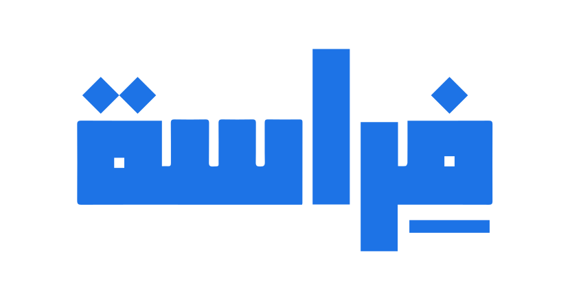

<p align="center">
  
</p>

# Firasa · فِراسة

<p align="center">
  
  
  
  
  
  
  
  
</p>

**Algorithmic audit engine for entrepreneurial maturity, built for the Tunisian ecosystem.**

Firasa runs a structured audit instead of a freeform chat. It asks adaptive questions, classifies the project stage, scores five business dimensions with transparent gated formulas, detects perception-reality gaps, and generates a roadmap where every recommendation traces to a real Tunisian resource. The LLM is a secondary layer -- it never drives classification or scoring, and the pipeline works end-to-end without it.

Three modules, one shared state via `app/orchestrator.py`:

- **Adaptive Diagnostic Engine** -- state-driven intake that branches by sector and declared stage. A deterministic six-stage classifier (Ideation, Market Validation, Structuration, Fundraising, Launch Planning, Growth) assigns a stage when all evidence gates 1..k are satisfied. Surfaces the perception-reality gap between declared and classified stage.

- **Explainable GWLC Scoring** -- five composite scores (Market, Commercial Offer, Innovation, Scalability, Green) computed as Gated Weighted Linear Combinations. Gates prevent strong scores from masking weak fundamentals. Every score decomposes into per-criterion contributions with plain-language justification.

- **RAG-Grounded Roadmap** -- maps diagnostic gaps and penalised scores to an ordered action plan. Retrieval uses metadata-routing before similarity search over 32+ real Tunisian resources (APII, BFPME, BTS, Startup Act, etc.). Every milestone has an order, rationale, time horizon, and source citation.

## Tech stack

Backend: Python, FastAPI, Pydantic v2. Retrieval: TF-IDF cosine similarity (swappable via `Retriever` interface, optional Cohere embeddings for semantic upgrade). LLM: abstracted provider (Ollama, HuggingFace, Groq, OpenAI, DeepSeek, Gemini, stub). Frontend: React (Vite), Rive animation, French-first.

## Running it

Backend, from `backend/`:

```
uvicorn app.main:app --reload          # serves http://localhost:8000
```

By default the backend expects a local Ollama instance. To run with no model installed, set `FIRASA_LLM_PROVIDER=stub`. See `.env.example` for all variables.

Frontend, from `frontend/`:

```
npm install
npm run dev                            # serves http://localhost:5173, proxies /api -> :8000
```

## Tests and evaluation

From `backend/`, with `FIRASA_LLM_PROVIDER=stub`:

```
python -m pytest tests/ -q
python -m app.eval_protocol
```

Current results: diagnostic Top-1 = 1.00, MASE = 0.00 across nine cases, RAG mean Precision@5 = 0.96, all adversarial gate checks pass.

## Project layout

```
firasa/
  backend/
    app/
      schema.py            shared ProjectProfile (single source of truth)
      intake/              adaptive state machine
      diagnostic/          rule-based classifier + perception-reality gap
      scoring/             GWLC engine, weights, gates
      rag/                 knowledge base, routed retriever, roadmap factory, kb.json
      llm/                 provider abstraction (Ollama / HF / stub)
      orchestrator.py      cross-module integration point
      explain.py           explainability traces
      main.py              FastAPI REST surface
      eval_protocol.py     evaluation metrics
      seed_scenarios.py    three labelled demo ventures
    tests/                 pytest suite
  frontend/                React (Vite) UI
  ARCHITECTURE.md          design and data flow
  SCORING_METHODOLOGY.md   formulas, weights, gates, and documented S_M discrepancy
```
